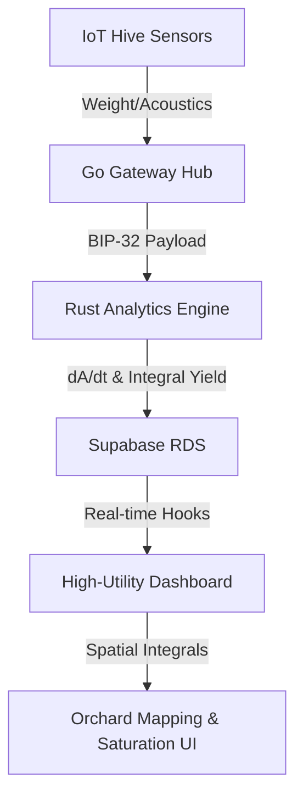

# BeeYield: Precision Apiculture & Economic Forecasting Platform

BeeYield is a professional-grade telemetry and intelligence ecosystem engineered to transition apiculture from reactive monitoring to pro-active, calculus-based economic forecasting. The platform integrates IoT weight dynamics, acoustic biological decoding, and geospatial saturation modeling to maximize pollination ROI.

---

## 📐 Core Mathematical Framework

### 1. Yield Dynamics & Nectar Flow Calculus
BeeYield utilizes continuous hive weight (CHW) to determine biological productivity through the **First Derivative of Weight over Time**:

$$ \text{Flow Rate} = \frac{dW}{dt} $$

- **Positive Influx ($\frac{dW}{dt} > 0$):** High-velocity nectar intake during forage windows. Dashboards indicate a "Green Zone" flow.
- **Anomaly Detection:** Rapid negative step-functions ($\Delta W < -2.0\text{kg/hr}$) paired with acoustic spikes trigger Swarm or Robbing alerts.

#### Cumulative Seasonal Yield
The definitive projection of honey harvest is calculated as the definite integral of all positive daily flux:

$$ Y = \int_{t_0}^{t_n} \max\left(0, \frac{dW}{dt}\right) dt $$

### 2. Spatial Intelligence & Saturation Math
Pollination efficacy follows an exponential decay function based on the distance ($d$) from the pallet gateway:

$$ P(d) = P_0 e^{-\lambda d} $$

where:
- $P_0$ is the initial pollination intensity.
- $\lambda$ is the biological decay constant specific to the crop (e.g., Almond vs. Blueberry).

The **Orchard Coverage Index** is determined by calculating the overlapping surface integrals of all active pallet halos to ensure 100% saturation across the property.

### 3. Biological Decoding (Acoustic AI)
Colony stressors are decoded via Mel-Frequency Cepstral Coefficients (MFCC) and spectral density analysis to detect:
- **Queen Presence:** Identified by stable, low-frequency harmonics.
- **Swarm Preparation:** Indicated by high-frequency pitch oscillation patterns.

---

## 🛠 Strategic Technology Stack

| Component | Architecture | Specification |
| :--- | :--- | :--- |
| **Telemetry Engine** | **Go** | Concurrency-optimized for high-frequency IoT duplexing. |
| **Logic Layer** | **Rust** | Memory-safe processing of yield math and beekeeper financials. |
| **AI Inference** | **Python** | Signal processing and YOLOv11-based computer vision for PCR tracking. |
| **Integrity Layer** | **C++ (Wasm)** | Client-side cryptographic batch verification and "Golden Thread" hashes. |
| **Frontend** | **React / Vite** | "High-Utility Brutalist" design utilizing Framer Motion for telemetry visualization. |

---

## 🏗 System Infrastructure

---

## 📋 Professional Feature Registry

1. **Precision Pollination Hub**: Field-specific optimization engines and BFH (Bee Flight Hours) forecasting.
2. **Economic Forecasting**: Automated "Grade A/B" pallet certification and ROI justification reports.
3. **Gateway Management**: Mesh network health tracking with 30-month preventive maintenance lifecycles.
4. **Contract Verification**: Cryptographic evidence of colony strength for premium per-hive payment negotiation.
5. **Traceability Engine**: End-to-end "Golden Thread" verification for honey product authentication.

---

## 📊 Deployment Requirements

- **Runtime**: Node.js v18+ 
- **Analytics**: Python 3.10+, Rust 1.70+, Go 1.20+
- **Infrastructure**: Supabase (PostgreSQL + RLS)

---
*Precision Tools for a Modern Apiary. Developed for Enterprise Pollination Management.*
