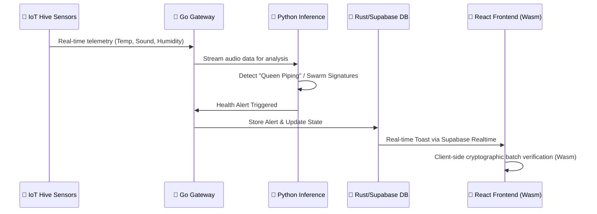

# 🐝 BeeYield: The Tesla of Apiculture

BeeYield is a state-of-the-art apiculture ecosystem marrying high-level engineering—**Rust, Wasm, AI**—with tangible environmental impact. We are redefining the "Hive-to-Table" lifecycle.

> **Mission Statement:** To protect the world's pollinators through bio-digital intelligence and provide consumers with radical transparency, ensuring every drop of honey is a testament to planetary health.

---

## 🚀 Vision: The Hive-to-Table Lifecycle

We don't just build tools; we build a predictive guardian for the planet's most vital workers.

- **Bio-Digital Intelligence**: Moving beyond simple monitoring to predictive AI that prevents colony collapse before it happens by detecting "Queen Piping" or swarm behavior through acoustic analysis.
- **Radical Transparency**: Combatting "honey laundering" and adulteration by providing a trustless, cryptographic record of every batch's origin, from flower to jar.

---

## 🛠️ Technology Stack: Strategic Polyglot Architecture

BeeYield leverages a powerful, multi-language architecture, where each language is chosen for a specific strategic purpose:

| Component | Tech Stack | Strategic Purpose |
| :--- | :--- | :--- |
| **Real-time Engine** | **Go** | Low-latency handling of thousands of concurrent IoT hive pings. |
| **Integrity Layer** | **C++ (Wasm)** | Heavyweight cryptographic hashing of batch data performed client-side for "Trustless" verification. |
| **Safety Layer** | **Rust** | Memory-safe handling of sensitive Beekeeper financial and yield data. |
| **Inference Layer** | **Python** | Running acoustic analysis models to detect colony health signatures. |

---

## 🏗️ System Architecture



---

## 🌟 Key Features

### 1. **Precision Pollination**
A comprehensive suite for farmers to request and manage pollination services. Features include crop-specific optimization and field health tracking.

### 2. **Blockchain Traceability (Radical Transparency)**
Every honey batch is verified using a distributed integrity system. Users can scan a QR code to see the "Golden Thread" connecting the beekeeper, the botanical origin, and lab results.

### 3. **Bio-Digital Dashboard**
Real-time monitoring of hive vitals. Features **Acoustic Visualization** where beekeepers can "see" hive health through pitch spectrograms.

### 4. **E-commerce Platform**
A premium marketplace for honey, hardware, and education, featuring **Offline-First Sync** with TanStack Query for beekeepers in low-connectivity areas.

---

## 📄 Feature Pages

| Page | Path | Description |
| :--- | :--- | :--- |
| **Home** | `/` | Main portal for pollination services and brand overview. |
| **Honey Landing** | `/honey` | Showcase of premium honey products with high-fidelity visuals. |
| **Shop** | `/shop` | Full-featured store for honey, hardware, and education. |
| **Traceability** | `/traceability` | Verification engine to check batch authenticity and integrity. |
| **BeeYield Dashboard** | `/beeyield-dashboard` | Professional workspace for beekeepers to monitor hives. |
| **Measurements** | `/measurements` | Deep dive into real-time sensor data and historical trends. |
| **Impact & ESG** | `/impact`, `/esg` | Live statistics on carbon offset, bee population growth, and social impact. |
| **BeeLearn** | `/learn` | Knowledge hub with articles and courses on sustainable apiculture. |
| **Global Hive Network** | `/global-hive-network` | Interactive map showing the reach of our connected hives. |
| **Admin Dashboard** | `/admin` | Centralized control for content, orders, and user management. |

---

## �️ Security & Scaling

- **Multi-tenancy**: Hardened Supabase RLS ensures commercial pollinators manage thousands of hives while hobbyists see only their own, with zero data leakage.
- **Deno Edge Functions**: Sub-50ms latency by handling logic at the edge between the Go gateway and Postgres.
- **React 19 Server Components**: Powering `/impact` and `/esg` for SEO-friendly, lightning-fast static data delivery.

---

## � Getting Started

### Prerequisites
- Node.js (v18+)
- Python 3.10+ (for backend/AI services)
- Rust (for database services)
- Go (for gateway services)

### Installation & Development
```bash
npm install
npm run dev
```

---
*Built with ❤️ for the bees and the engineers who protect them.*

## 🔧 Recent Operational Updates (Feb 2026)

### 🧹 Data Restoration & Schema Alignment
- **Timothy Nduva Restoration**: Successfully purged and restored full historical data for `timothynduva349@gmail.com`, including:
  - 184 Hives (KIB-H101 to KIB-H284)
  - 35 Harvest records (2020-2026) totaling ~943kg of honey.
  - Custom batch codes following the `Hivename-Year-Date` convention.
  - Active Macadamia Pollination Contract for 25 acres in Kibwezi.
- **Schema Harmonization**: Rectified discrepancies between backend models and live database schemas, specifically mapping `quantity_kg` and `first_name`/`last_name` correctly.
- **Auth Metadata Sync**: Updated Supabase Auth metadata for administrative accounts to ensure seamless frontend profile rendering.

### 🛠️ Backend API Fixes
- **Farmer Name Resolution**: Fixed a critical bug in `beeyield.py` where the API was querying a non-existent `full_name` field. It now dynamically reconstructs the name from `first_name` and `last_name` from the `profiles` table.
- **REST Protocol Stability**: Switched administrative scripts to direct HTTP/PostgREST interfaces to bypass schema cache invalidation issues on edge instances.

